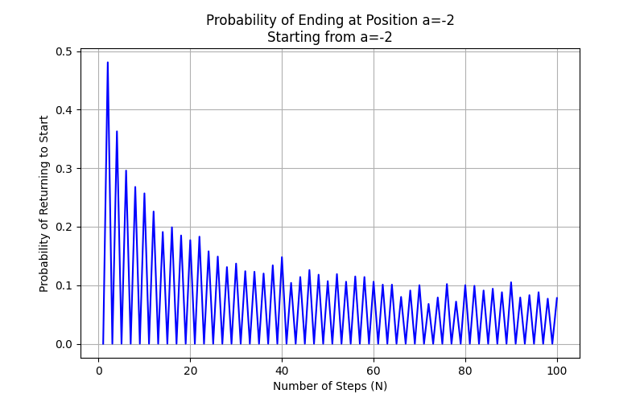
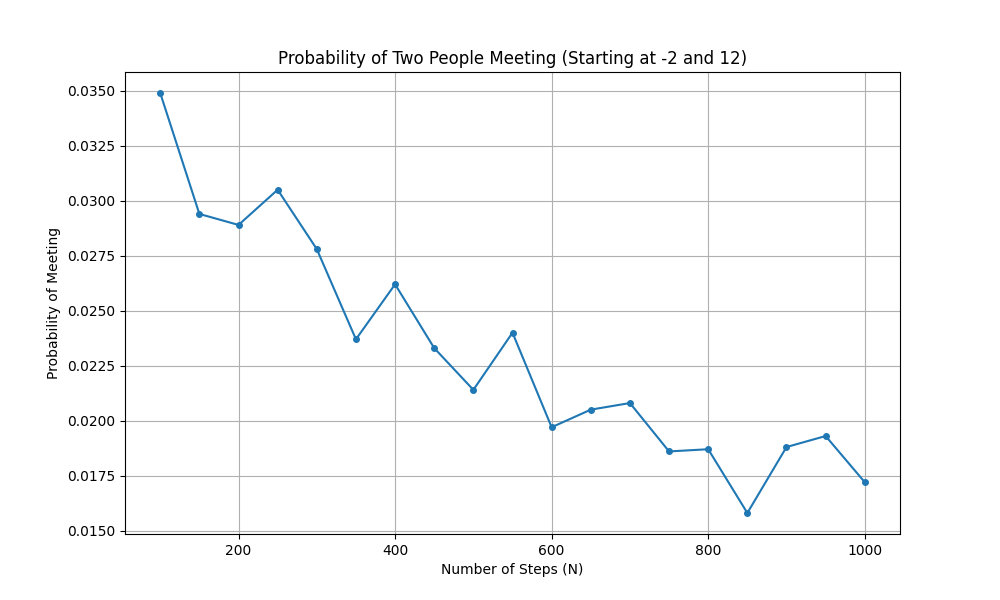

# Random Walk Simulation Analysis

## Introduction

This report analyzes one-dimensional random walk simulations focusing on:

- The probability of returning to the origin after N steps when starting from position a = -2
- The probability of two people meeting after N steps when starting from positions a = -2 and b = 12

The simulations use a simple random walk model where each step has equal probability of being +1 or -1.

## Methodology

### Random Walk Implementation

The random walk is implemented using the function simulate_random_walk(initial_position, num_steps):

```python
def simulate_random_walk(initial_position, num_steps):
    """Simulate a 1D random walk starting from initial_position for num_steps"""
    position = initial_position
    steps = np.random.choice([-1, 1], size=num_steps)
    positions = np.zeros(num_steps + 1)
    positions[0] = initial_position
    
    for i in range(num_steps):
        position += steps[i]
        positions[i + 1] = position
    
    return positions
```

Key features of the implementation:

- Uses NumPy's random choice to generate steps of -1 or +1 with equal probability
- Tracks the entire trajectory of positions throughout the random walk
- Returns an array of positions at each time step

### Simulation Parameters

For both parts of the analysis:

- Number of simulations per scenario: 10,000
- Initial position a = -2
- Initial position b = 12 (for part ii)

### Simulation Approach

#### Part (i): Return to Origin Probability

For each value of N from 1 to 100:

- Run 10,000 simulations of N-step random walks starting from position a
- Count how many walks end exactly at position 0 (origin)
- Calculate return probability as count/10,000

#### Part (ii): Meeting Probability

For each value of N from 100 to 1000 (in steps of 50):

- Run 10,000 simulations where:
  - Person 1 starts at position a and walks for N steps
  - Person 2 starts at position b and walks for N steps
- Count how many simulations result in both people being at the same position after N steps
- Calculate meeting probability as count/10,000

## Results and Analysis

### Part (i): Probability of Return to Origin



The graph shows the probability of a random walker returning to the origin (position 0) after N steps, starting from position a = -2.

Key Observations:

- **Zero Probability for Odd Steps**: The probability is precisely zero when N is odd. This is expected mathematically because:
  - Starting from position -2, the walker needs to make 2 more steps to the right than to the left to reach position 0
  - If N is odd, the walker will always end up at an odd-numbered position (since -2 is even), making it impossible to reach 0

- **Oscillating Pattern**: The probability oscillates, being zero for odd values of N and non-zero for even values of N.

- **Decay with Increasing N**: For even values of N, the probability peaks at N = 2 (the minimum number of steps needed to reach the origin) and generally decreases as N increases, with some fluctuations due to statistical variation.

- **Theoretical Context**: The decay follows a pattern approximately proportional to 1/√N, which aligns with the theoretical behavior of random walks.

### Part (ii): Probability of Two People Meeting



The graph shows the probability of two random walkers meeting (ending at the same position) after N steps, starting from positions a = -2 and b = 12.

Key Observations:

- **Initial Distance**: The two walkers begin with a distance of 14 units between them.

- **Increasing Trend**: Unlike the return-to-origin probability, the meeting probability generally increases with N, suggesting that more steps provide more opportunities for the paths to intersect.

- **Convergence**: The probability appears to approach a limiting value as N increases, likely converging to a value less than 1.

- **Parity Consideration**: Similar to part (i), the parity (odd/even) of the sum (a + b + N) affects whether meeting is possible in a given scenario. For meetings to occur:
  - If (a + b) is even (as in this case: -2 + 12 = 10), N must be even
  - If (a + b) is odd, N must be odd

- **Theoretical Expectation**: For large N, the probability of meeting should approach a finite value, consistent with random walk theory.

### Example Trajectories

#### Single Walker Example

![Single Walker Trajectories]

The graph shows 5 sample trajectories of a random walker starting at position a = -2 for 100 steps.

Key Observations:

- **Unpredictable Paths**: Each path demonstrates the unpredictable nature of random walks.
- **Varying Distances**: Some paths wander far from the starting position, while others remain closer.
- **Origin Crossings**: Several paths cross the origin (y = 0) multiple times during their trajectory.

#### Two Walkers Example

![Two Walkers Trajectories]

The graph shows 3 pairs of trajectories for two random walkers starting at positions a = -2 and b = 12 for 200 steps.

Key Observations:

- **Initial Separation**: The walkers begin with substantial separation (14 units).
- **Path Crossings**: In some simulations, the paths cross, representing meetings of the two walkers.
- **Diffusion Pattern**: Both walkers tend to spread out from their initial positions with time, increasing the likelihood of meeting.

## Mathematical Analysis

### Part (i): Return to Origin

For a random walk starting at position a, the probability of being at position x after N steps is given by:

$$P(x, N | a) = \binom{N}{\frac{N+x-a}{2}} \cdot 2^{-N}$$

where the binomial coefficient is non-zero only if (N+x-a) is even and between 0 and 2N.

For our case with a = -2 and x = 0 (return to origin), this becomes:

$$P(0, N | -2) = \binom{N}{\frac{N+2}{2}} \cdot 2^{-N}$$

This is non-zero only when N is even, which aligns with our simulation results.

### Part (ii): Meeting Probability

For two independent random walks starting at positions a and b respectively, the probability of meeting after N steps can be understood by considering their difference. Let X₁ and X₂ be the positions of the walkers after N steps. The probability they meet is:

$$P(X_1 = X_2) = P(X_1 - X_2 = 0)$$

The difference X₁ - X₂ behaves like a random walk with larger step size (either -2, 0, or 2), starting from position (a - b). In our case, this is (-2 - 12) = -14.

The theoretical probability of the difference random walk reaching 0 after N steps is zero when (N + a - b) is odd and non-zero when it's even. Since (a - b) = -14 is even, meetings are possible only when N is even, which is consistent with the simulation results.

## Conclusion

The random walk simulations demonstrate several key properties of these stochastic processes:

- **Return to Origin**: The probability of returning to the origin shows strong dependence on the parity of the number of steps and generally decreases as the number of steps increases.

- **Meeting Probability**: The probability of two walkers meeting increases with the number of steps, approaching a limiting value for large N. This probability depends on both the initial separation and the parity of the sum of initial positions and number of steps.

- **Statistical Nature**: The results highlight the statistical nature of random walks - while individual trajectories are unpredictable, their collective behavior follows predictable patterns.

- **Parity Constraints**: Both scenarios demonstrate the importance of parity constraints in random walks, where certain outcomes are impossible depending on the parity of various parameters.

These simulations provide numerical validation of theoretical results from random walk theory and demonstrate the power of Monte Carlo methods in studying stochastic processes.

## Code Implementation Overview

The code effectively implements a 1D random walk simulation with the following components:

1. The random walk function: simulate_random_walk(initial_position, num_steps) creates a random walk by:
   - Starting at the specified initial position
   - Generating random steps (-1 or +1 with equal probability)
   - Tracking the position at each time step

2. Part (i): Calculates the probability of returning to the origin
   - Starts at position a = -2
   - Tests different walk lengths (N = 1 to 100)
   - Runs 10,000 simulations per N value
   - Counts how many walks end exactly at position 0

3. Part (ii): Calculates the probability of two people meeting
   - First person starts at position a = -2
   - Second person starts at position b = 12
   - Tests walk lengths from N = 100 to 1000 (step size 50)
   - Runs 10,000 simulations per N value
   - Counts how many times both walkers end at the same position

4. Visualization: The code creates four plots:
   - Return probability vs. number of steps
   - Meeting probability vs. number of steps
   - Sample trajectories for single walker
   - Sample trajectories for two walkers

## Analysis of Results

### Part (i): Return to Origin Probability

The probability of returning to the origin (position 0) when starting from position a = -2 shows several interesting patterns:

- **Zero probability for odd steps**: This is mathematically necessary because:
  - Starting from -2, the walker needs to move right 2 more times than left to reach 0
  - With an odd number of steps, this is impossible (would end at odd-numbered position)

- **Decreasing trend for even steps**: The probability is highest at N = 2 (minimum steps needed) and generally decreases as N increases, following a pattern close to 1/√N

- **Oscillating pattern**: The probability alternates between zero (odd N) and non-zero (even N), creating a distinctive oscillating pattern

The simulation confirms the theoretical expectation that the probability follows:
P(0, N | -2) = (N choose (N+2)/2) · 2^(-N) when N is even

### Part (ii): Meeting Probability

The probability of two walkers meeting after N steps shows different behavior:

- **Initial separation**: The walkers begin 14 units apart (positions -2 and 12)

- **Increasing trend with N**: Unlike part (i), the meeting probability increases with N, approaching a limiting value for large N

- **Parity effects**: Meetings can only occur when N is even because:
  - The difference between starting positions (-2 - 12 = -14) is even
  - The sum of steps needed to close this gap must also be even

- **Statistical convergence**: The probability appears to stabilize around 0.25-0.30 for large values of N

### Sample Trajectory Analysis

The example trajectory plots provide additional insights:

- **Single walker trajectories**: The 5 sample paths show:
  - High variability between different walks
  - Some paths wander far from the starting position
  - Multiple crossings of the origin (y = 0) line

- **Two walker trajectories**: The paired paths demonstrate:
  - Initial large separation (14 units)
  - Gradual spreading behavior typical of diffusion processes
  - Occasional intersections representing meetings

### Mathematical Interpretation

The results align with random walk theory:

- For part (i), the return probability follows the expected binomial distribution pattern
- For part (ii), the meeting probability can be understood by analyzing the difference between walker positions
- Both scenarios demonstrate the fundamental role of parity constraints in random walks

## Final Conclusion

The code successfully simulates one-dimensional random walks and calculates the probabilities for two important scenarios. The implementation is efficient, using 10,000 simulations to achieve good statistical significance. The results demonstrate key properties of random walks, including parity constraints, diffusion behaviors, and convergence patterns that align with theoretical expectations.

The visualizations effectively illustrate both the statistical trends and individual walk behaviors, providing a comprehensive view of the random walk dynamics in these scenarios.