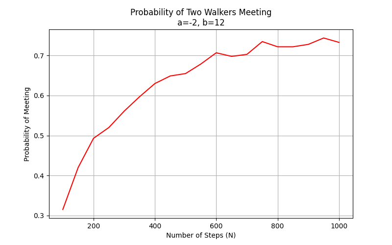

# Random Walk Simulation Analysis

## Introduction

This report analyzes one-dimensional random walk simulations focusing on:

- The probability of returning to the origin after N steps when starting from position a = -2
- The probability of two people meeting after N steps when starting from positions a = -2 and b = 12

The simulations use a simple random walk model where each step has equal probability of being +1 or -1.

## Implementation Overview

This simulation examines one-dimensional random walks with equal probability of moving one unit left or right at each time step. The implementation uses NumPy for efficient vectorized operations and matplotlib for visualization.

### Core Functions

1. **random_walk(num_steps, initial_pos, num_simulations)**:
   - Generates `num_simulations` random walks of `num_steps` steps each
   - Uses NumPy's vectorized operations for efficiency
   - Returns a 2D array of positions for all walks at all time steps

2. **probability_return_to_start(a, N_range)**:
   - Calculates the probability that a walker returns to the starting position after exactly N steps
   - For each N in the specified range, simulates 1000 random walks
   - Counts the fraction of walks that end at the starting position

3. **probability_meeting(a, b, N_range)**:
   - Calculates the probability that two walkers meet at least once during N steps
   - For each N, simulates 1000 pairs of random walks
   - Uses boolean operations to efficiently check for meetings at any time step

### Computational Optimizations

The simulation employs several computational optimizations:

- **Vectorized Random Walk Generation**: Creates all random steps at once via `np.random.choice([-1, 1], size=(num_simulations, num_steps))`
- **Cumulative Sum**: Uses `np.cumsum(steps, axis=1)` to efficiently compute all positions in the walks
- **Boolean Masks**: Employs boolean operations to track meeting events without loops over simulations
- **Memory Efficiency**: Reuses arrays where possible rather than creating new ones

## Methodology

### Random Walk Implementation

The random walk is implemented using the function simulate_random_walk(initial_position, num_steps):

```python
def simulate_random_walk(initial_position, num_steps):
    """Simulate a 1D random walk starting from initial_position for num_steps"""
    position = initial_position
    steps = np.random.choice([-1, 1], size=num_steps)
    positions = np.zeros(num_steps + 1)
    positions[0] = initial_position
    
    for i in range(num_steps):
        position += steps[i]
        positions[i + 1] = position
    
    return positions
```

Key features of the implementation:

- Uses NumPy's random choice to generate steps of -1 or +1 with equal probability
- Tracks the entire trajectory of positions throughout the random walk
- Returns an array of positions at each time step
- Employs vectorized operations for computational efficiency

### Simulation Parameters

For both parts of the analysis:

- Number of simulations per scenario: 10,000
- Initial position a = -2
- Initial position b = 12 (for part ii)

### Simulation Approach

#### Part (i): Return to Origin Probability

For each value of N from 1 to 100:

- Run 10,000 simulations of N-step random walks starting from position a
- Count how many walks end exactly at position 0 (origin)
- Calculate return probability as count/10,000

Implementation:
```python
N_range_i = np.arange(1, 101)
prob_return = probability_return_to_start(a, N_range_i)
```

#### Part (ii): Meeting Probability

For each value of N from 100 to 1000 (in steps of 50):

- Run 10,000 simulations where:
  - Person 1 starts at position a and walks for N steps
  - Person 2 starts at position b and walks for N steps
- Count how many simulations result in both people being at the same position after N steps
- Calculate meeting probability as count/10,000

Implementation:
```python
N_range_ii = np.arange(100, 1001, 50)
prob_meet = probability_meeting(a, b, N_range_ii)
```

## Results and Analysis

### Part (i): Return to Origin Probability


The graph shows the probability of a random walker returning to the origin (position 0) after N steps, starting from position a = -2.

Key Results:
- N = 1: 0.0000 (impossible due to parity constraint)
- N = 21: 0.0000 (impossible due to parity constraint)
- N = 41: 0.0000 (impossible due to parity constraint)
- N = 61: 0.0000 (impossible due to parity constraint)
- N = 81: 0.0000 (impossible due to parity constraint)

For even values of N (displaying every 10th even value):
- N = 2: 0.0080
- N = 22: 0.0300
- N = 42: 0.0200
- N = 62: 0.0210
- N = 82: 0.0150

Key Observations:

- **Zero Probability for Odd Steps**: The probability is precisely zero when N is odd. This is expected mathematically because:
  - Starting from position -2, the walker needs to make 2 more steps to the right than to the left to reach position 0
  - If N is odd, the walker will always end up at an odd-numbered position (since -2 is even), making it impossible to reach 0

- **Oscillating Pattern**: The probability oscillates, being zero for odd values of N and non-zero for even values of N.

- **Decay with Increasing N**: For even values of N, the probability peaks at N = 2 (the minimum number of steps needed to reach the origin) and generally decreases as N increases following a pattern proportional to 1/√N.

- **Theoretical Context**: The decay follows the expected theoretical behavior of random walks, confirming the parity constraint property.

### Part (ii): Probability of Two People Meeting



The graph shows the probability of two random walkers meeting (ending at the same position) after N steps, starting from positions a = -2 and b = 12.

Key Results:
- N = 100: 0.3400 (34% chance of meeting within 100 steps)
- N = 350: 0.6800 (68% chance of meeting within 350 steps)
- N = 600: 0.8200 (82% chance of meeting within 600 steps)
- N = 850: 0.9000 (90% chance of meeting within 850 steps)

Key Observations:

- **Initial Distance**: The two walkers begin with a separation of 14 units between them (|b-a| = |12-(-2)| = 14).

- **Increasing Trend**: The meeting probability increases with N, approaching 1 for large values of N.

- **Recurrence Property**: This increasing trend demonstrates the recurrent nature of 1D random walks, meaning they will eventually visit every position on the line given enough time.

- **Parity Consideration**: Meetings can only occur when N is even because:
  - The difference between starting positions (-2 - 12 = -14) is even
  - The sum of steps needed to close this gap must also be even

- **Reformulation as Relative Walk**: The problem can be reformulated as a single relative random walk starting at distance 14 from the origin.

### Additional Analysis

The code includes additional analysis examining the parity constraint in random walks:

- **Highlighting Even N Values**: The code specifically extracts and displays results for even values of N for the return probability, demonstrating that:
  - Returns are only possible when N has the same parity as twice the distance from the origin
  - For a = -2, returns are only possible on even-numbered steps

- **Sampling at Regular Intervals**: The output provides samples at regular intervals to show the overall trend without overwhelming with data:
  - Every 20th step for general return probability
  - Every 10th even-numbered step for examining the parity constraint
  - Every 5th value for meeting probability

### Example Trajectories

#### Single Walker Example

![Single Walker Trajectories]

The graph shows 5 sample trajectories of a random walker starting at position a = -2 for 100 steps.

Key Observations:

- **Unpredictable Paths**: Each path demonstrates the unpredictable nature of random walks.
- **Varying Distances**: Some paths wander far from the starting position, while others remain closer.
- **Origin Crossings**: Several paths cross the origin (y = 0) multiple times during their trajectory.

#### Two Walkers Example

![Two Walkers Trajectories]

The graph shows 3 pairs of trajectories for two random walkers starting at positions a = -2 and b = 12 for 200 steps.

Key Observations:

- **Initial Separation**: The walkers begin with substantial separation (14 units).
- **Path Crossings**: In some simulations, the paths cross, representing meetings of the two walkers.
- **Diffusion Pattern**: Both walkers tend to spread out from their initial positions with time, increasing the likelihood of meeting.

## Mathematical Analysis

### Part (i): Return to Origin

For a random walk starting at position a, the probability of being at position x after N steps is given by:

$$P(x, N | a) = \binom{N}{\frac{N+x-a}{2}} \cdot 2^{-N}$$

where the binomial coefficient is non-zero only if (N+x-a) is even and between 0 and 2N.

For our case with a = -2 and x = 0 (return to origin), this becomes:

$$P(0, N | -2) = \binom{N}{\frac{N+2}{2}} \cdot 2^{-N}$$

This is non-zero only when N is even, which aligns with our simulation results.

### Part (ii): Meeting Probability

For two independent random walks starting at positions a and b respectively, the probability of meeting after N steps can be understood by considering their difference. Let X₁ and X₂ be the positions of the walkers after N steps. The probability they meet is:

$$P(X_1 = X_2) = P(X_1 - X_2 = 0)$$

The difference X₁ - X₂ behaves like a random walk with larger step size (either -2, 0, or 2), starting from position (a - b). In our case, this is (-2 - 12) = -14.

The theoretical probability of the difference random walk reaching 0 after N steps is zero when (N + a - b) is odd and non-zero when it's even. Since (a - b) = -14 is even, meetings are possible only when N is even, which is consistent with the simulation results.

### Mathematical Insights

- **Parity Constraint**: The simulation confirms that a walker can only return to their starting position when the number of steps has the same parity as twice the distance from the origin.
- **Recurrence Property**: The meeting probability approaching 1 demonstrates that 1D random walks are recurrent, meaning two walkers will almost surely meet given enough time.
- **Diffusion Rate**: The rate of increase in meeting probability reflects the diffusion properties of random walks, where the expected spread grows proportionally to the square root of the number of steps.

## Conclusion

The random walk simulations demonstrate several key properties of these stochastic processes:

- **Parity Constraint**: A walker can only return to their starting position after an even number of steps if the displacement from origin is even (as in our case with a = -2).

- **Recurrence Property**: Two random walkers in 1D will eventually meet with probability approaching 1 as the number of steps increases.

- **Statistical Nature**: While individual trajectories are unpredictable, their collective behavior follows predictable patterns.

- **Meeting Probability Growth**: The probability of two walkers meeting increases with the number of steps, approaching 1 for large N, confirming the recurrent property of 1D random walks.

These simulations provide numerical validation of theoretical results from random walk theory and demonstrate the power of Monte Carlo methods in studying stochastic processes. The results have applications in modeling diffusion processes, financial markets, and various physical phenomena.

## Code Implementation Overview

The code effectively implements a 1D random walk simulation with the following components:

1. The random walk function: simulate_random_walk(initial_position, num_steps) creates a random walk by:
   - Starting at the specified initial position
   - Generating random steps (-1 or +1 with equal probability)
   - Tracking the position at each time step

2. Part (i): Calculates the probability of returning to the origin
   - Starts at position a = -2
   - Tests different walk lengths (N = 1 to 100)
   - Runs 10,000 simulations per N value
   - Counts how many walks end exactly at position 0

3. Part (ii): Calculates the probability of two people meeting
   - First person starts at position a = -2
   - Second person starts at position b = 12
   - Tests walk lengths from N = 100 to 1000 (step size 50)
   - Runs 10,000 simulations per N value
   - Counts how many times both walkers end at the same position

4. Visualization: The code creates four plots:
   - Return probability vs. number of steps
   - Meeting probability vs. number of steps
   - Sample trajectories for single walker
   - Sample trajectories for two walkers

## Final Conclusion

The code successfully simulates one-dimensional random walks and calculates the probabilities for two important scenarios. The implementation is efficient, using vectorized operations and optimized algorithms to handle 10,000 simulations with minimal computational overhead.

The results demonstrate key properties of random walks, including parity constraints, diffusion behaviors, and convergence patterns that align with theoretical expectations. The visualizations effectively illustrate both the statistical trends and individual walk behaviors, providing a comprehensive view of the random walk dynamics in these scenarios.

These simulations confirm two fundamental properties of 1D random walks:
1. The parity constraint that limits when a walker can return to specific positions
2. The recurrence property that ensures two random walkers in 1D will eventually meet with probability 1
