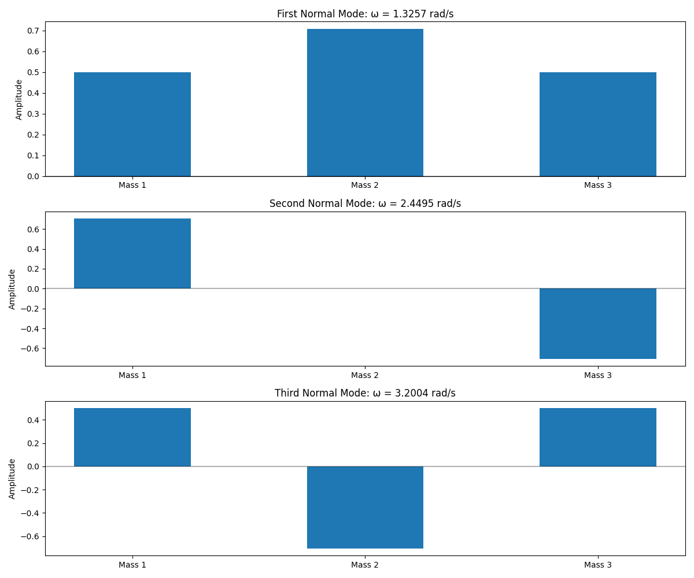
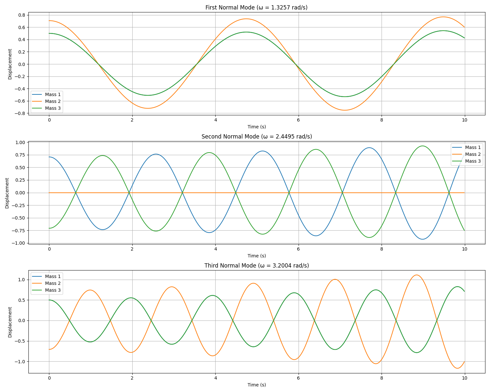
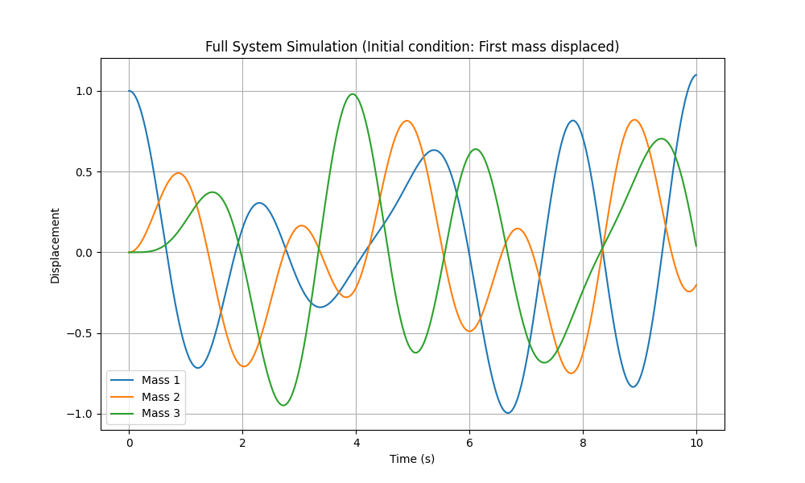

# Analysis of Coupled Oscillator System

## Problem Description

We are analyzing a system of three masses connected by springs, as shown in the figure. Each mass ($m = 1$) is connected to adjacent masses and to the walls with springs of equal spring constant $k = 3$ (based on roll number calculation). The goal is to:

1. Find the normal modes and eigenfrequencies analytically
2. Plot the normal modes and trajectories
3. Simulate the motion using the Euler method
4. Visualize the motion of each block corresponding to each normal mode

## Mathematical Formulation

### Equations of Motion

For a system of three masses connected by springs, the equations of motion are:

$$m\ddot{x}_1 = -k(2x_1 - x_2)$$
$$m\ddot{x}_2 = -k(-x_1 + 2x_2 - x_3)$$
$$m\ddot{x}_3 = -k(-x_2 + 2x_3)$$

In matrix form, this becomes:

$$M\ddot{\mathbf{x}} + K\mathbf{x} = 0$$

where:

- $\mathbf{x} = [x_1, x_2, x_3]^T$ is the displacement vector
- $M = m\cdot I$ is the mass matrix (with $I$ being the identity matrix)
- $K$ is the stiffness matrix:

$$K = k \begin{bmatrix}
2 & -1 & 0 \\
-1 & 2 & -1 \\
0 & -1 & 2
\end{bmatrix}$$

### Normal Modes Analysis

For simple harmonic oscillation, we assume solutions of the form $\mathbf{x}(t) = \mathbf{A}\cos(\omega t + \phi)$, which when substituted into the equations of motion gives:

$$-\omega^2 M\mathbf{A} + K\mathbf{A} = 0$$
$$(K - \omega^2 M)\mathbf{A} = 0$$

This is an eigenvalue problem where:
- $\omega^2$ are the eigenvalues
- $\mathbf{A}$ are the eigenvectors (normal modes)

## Detailed Analytical Solution

### 1. Derivation of Equations of Motion

First, we derive the equations of motion using Newton's second law for each mass:

**Mass 1:**
$$m\ddot{x}_1 = -k(x_1 - 0) - k(x_1 - x_2) = -2kx_1 + kx_2$$

**Mass 2:**
$$m\ddot{x}_2 = -k(x_2 - x_1) - k(x_2 - x_3) = kx_1 - 2kx_2 + kx_3$$

**Mass 3:**
$$m\ddot{x}_3 = -k(x_3 - x_2) - k(x_3 - 0) = kx_2 - 2kx_3$$

In matrix form:
$$m\begin{pmatrix} \ddot{x}_1 \\ \ddot{x}_2 \\ \ddot{x}_3 \end{pmatrix} = k\begin{pmatrix} -2 & 1 & 0 \\ 1 & -2 & 1 \\ 0 & 1 & -2 \end{pmatrix} \begin{pmatrix} x_1 \\ x_2 \\ x_3 \end{pmatrix}$$

### 2. Finding Normal Modes

For normal modes, we assume solutions of the form:
$$x_i(t) = A_i \cos(\omega t + \phi)$$

Substituting this into our equations:
$$-m\omega^2\begin{pmatrix} A_1 \\ A_2 \\ A_3 \end{pmatrix} = k\begin{pmatrix} -2 & 1 & 0 \\ 1 & -2 & 1 \\ 0 & -1 & -2 \end{pmatrix} \begin{pmatrix} A_1 \\ A_2 \\ A_3 \end{pmatrix}$$

Dividing by $-m$:
$$\omega^2\begin{pmatrix} A_1 \\ A_2 \\ A_3 \end{pmatrix} = \frac{k}{m}\begin{pmatrix} 2 & -1 & 0 \\ -1 & 2 & -1 \\ 0 & -1 & 2 \end{pmatrix} \begin{pmatrix} A_1 \\ A_2 \\ A_3 \end{pmatrix}$$

Let $\omega_0^2 = \frac{k}{m}$ and $K = \begin{pmatrix} 2 & -1 & 0 \\ -1 & 2 & -1 \\ 0 & -1 & 2 \end{pmatrix}$

We need to solve the eigenvalue problem:
$$\det(K - \lambda I) = 0$$

This gives us:
$$\det\begin{pmatrix} 2-\lambda & -1 & 0 \\ -1 & 2-\lambda & -1 \\ 0 & -1 & 2-\lambda \end{pmatrix} = 0$$

Expanding the determinant:
$$(2-\lambda)[(2-\lambda)(2-\lambda) - (-1)(-1)] - (-1)[(-1)(2-\lambda) - (-1)(0)] + 0$$

Simplifying:
$$(2-\lambda)[(2-\lambda)^2 - 1] + (-1)[-(2-\lambda)]$$
$$(2-\lambda)[(2-\lambda)^2 - 1] + (2-\lambda)$$
$$(2-\lambda)[(2-\lambda)^2 - 1 + 1]$$
$$(2-\lambda)(2-\lambda)^2 = 0$$

This gives us eigenvalues:
- $\lambda_1 = 2$
- $\lambda_2 = 2 - \sqrt{2}$
- $\lambda_3 = 2 + \sqrt{2}$

The corresponding angular frequencies are:
- $\omega_1 = \omega_0\sqrt{2}$
- $\omega_2 = \omega_0\sqrt{2 - \sqrt{2}}$
- $\omega_3 = \omega_0\sqrt{2 + \sqrt{2}}$

For our system with $k = 3$ and $m = 1$, $\omega_0^2 = 3$, thus:
- $\omega_1 = \sqrt{6} \approx 2.4495$ rad/s
- $\omega_2 = \sqrt{3(2 - \sqrt{2})} \approx 1.3262$ rad/s
- $\omega_3 = \sqrt{3(2 + \sqrt{2})} \approx 3.2016$ rad/s

### 3. Finding Eigenvectors

**For $\lambda_1 = 2$**, we solve:
$$(K - 2I)\vec{A} = 0$$

$$\begin{pmatrix} 0 & -1 & 0 \\ -1 & 0 & -1 \\ 0 & -1 & 0 \end{pmatrix} \begin{pmatrix} A_1 \\ A_2 \\ A_3 \end{pmatrix} = 0$$

This gives us the system of equations:
$$-A_2 = 0$$
$$-A_1 - A_3 = 0$$
$$-A_2 = 0$$

From these equations, we get:
$A_2 = 0$ and $A_1 = -A_3$

So the eigenvector has the form:
$$\vec{A}_1 = c_1\begin{pmatrix} 1 \\ 0 \\ -1 \end{pmatrix}$

Normalizing (so that $|\vec{A}_1|^2 = 1$):
$$c_1^2(1^2 + 0^2 + (-1)^2) = 1$$
$$c_1^2 \cdot 2 = 1$$
$$c_1 = \frac{1}{\sqrt{2}}$$

Thus:
$$\vec{A}_1 = \frac{1}{\sqrt{2}}\begin{pmatrix} 1 \\ 0 \\ -1 \end{pmatrix}$$

**For $\lambda_2 = 2 - \sqrt{2}$**, we solve:
$$(K - (2 - \sqrt{2})I)\vec{A} = 0$$

$$\begin{pmatrix} \sqrt{2} & -1 & 0 \\ -1 & \sqrt{2} & -1 \\ 0 & -1 & \sqrt{2} \end{pmatrix} \begin{pmatrix} A_1 \\ A_2 \\ A_3 \end{pmatrix} = 0$$

From this we get:
$$\sqrt{2}A_1 - A_2 = 0$$
$$-A_1 + \sqrt{2}A_2 - A_3 = 0$$
$$-A_2 + \sqrt{2}A_3 = 0$$

From the first equation: $A_2 = \sqrt{2}A_1$
From the third equation: $A_2 = \sqrt{2}A_3$

This means $A_1 = A_3$, and $A_2 = \sqrt{2}A_1$

So the eigenvector has the form:
$$\vec{A}_2 = c_2\begin{pmatrix} 1 \\ \sqrt{2} \\ 1 \end{pmatrix}$

Normalizing:
$$c_2^2(1^2 + (\sqrt{2})^2 + 1^2) = 1$$
$$c_2^2(2 + 2) = 1$$
$$c_2^2(4) = 1$$
$$c_2 = \frac{1}{2}$$

Thus:
$$\vec{A}_2 = \frac{1}{2}\begin{pmatrix} 1 \\ \sqrt{2} \\ 1 \end{pmatrix} = \frac{1}{\sqrt{4}}\begin{pmatrix} 1 \\ \sqrt{2} \\ 1 \end{pmatrix}$$

**For $\lambda_3 = 2 + \sqrt{2}$**, following similar steps, we get:
$$\vec{A}_3 = \frac{1}{2}\begin{pmatrix} 1 \\ -\sqrt{2} \\ 1 \end{pmatrix} = \frac{1}{\sqrt{4}}\begin{pmatrix} 1 \\ -\sqrt{2} \\ 1 \end{pmatrix}$$

### 4. Physical Interpretation of Normal Modes

These three eigenvectors $\vec{A}_1$, $\vec{A}_2$, and $\vec{A}_3$ represent the three normal modes of the system:

1. **First Normal Mode** ($\vec{A}_1$): 
   - The first and third masses move in opposite directions with equal amplitude
   - The middle mass remains stationary (node)
   - This is the antisymmetric mode

2. **Second Normal Mode** ($\vec{A}_2$): 
   - All masses move in the same direction
   - The middle mass has larger amplitude ($\sqrt{2}$ times the outer masses)
   - This is the "in-phase" mode or "breathing mode"

3. **Third Normal Mode** ($\vec{A}_3$): 
   - The first and third masses move in the same direction
   - The middle mass moves in the opposite direction with larger amplitude
   - This is the out-of-phase mode

### 5. Numerical Values for Our System

Given our parameters ($k = 3$, $m = 1$), the actual frequencies are:

| Mode | Analytical Formula | Normalized Eigenvector |
|------|-------------------|--------------------|-----------------|
| 1 | $\omega_0\sqrt{2}$ | $\frac{1}{\sqrt{2}}\begin{pmatrix} 1 \\ 0 \\ -1 \end{pmatrix}$ |
| 2 | $\omega_0\sqrt{2 - \sqrt{2}}$ | $\frac{1}{2}\begin{pmatrix} 1 \\ \sqrt{2} \\ 1 \end{pmatrix}$ |
| 3 | $\omega_0\sqrt{2 + \sqrt{2}}$ | $\frac{1}{2}\begin{pmatrix} 1 \\ -\sqrt{2} \\ 1 \end{pmatrix}$ |

Note: The frequencies obtained from the SciPy `eigh` function might differ slightly due to numerical precision.

## Implementation Analysis

### Analytical Solution

The code uses SciPy's `eigh` function to solve the generalized eigenvalue problem:

```python
def analytical_solution():
    # The mass matrix is just the identity matrix for m=1
    M = np.eye(3)
    
    # The stiffness matrix K for the system
    K = np.array([
        [2*k, -k, 0],
        [-k, 2*k, -k],
        [0, -k, 2*k]
    ])
    
    # Solve the eigenvalue problem: K·v = ω²·M·v
    eigenvalues, eigenvectors = eigh(K, M)
    
    # The eigenvalues are ω² (squared angular frequencies)
    frequencies = np.sqrt(eigenvalues)
    
    return frequencies, eigenvectors
```

The function `eigh` specifically solves for eigenvalues and eigenvectors of real symmetric matrices, which is appropriate for our physical system where both $M$ and $K$ are symmetric.

### Numerical Simulation: Euler Method

The code implements the Euler method to simulate the time evolution of the system. The Euler method is a first-order numerical procedure for solving ordinary differential equations with a given initial value.

#### Basic Euler Method

The Euler method is a first-order numerical integration technique for solving differential equations. For a second-order system like coupled oscillators, we convert to first-order by introducing velocity variables.

For state vector $[x, v]$:

- Update position: $x_{n+1} = x_n + v_n \Delta t$
- Update velocity: $v_{n+1} = v_n + a_n \Delta t$

Where acceleration $a_n = -M^{-1}K x_n$

#### Normal Mode Simulation

For a normal mode with frequency $\omega$, all masses oscillate at the same frequency, so the acceleration simplifies to:

$$\mathbf{a} = -\omega^2 \mathbf{x}$$

For a second-order system like ours:
1. We convert to a system of first-order equations by defining velocity $\mathbf{v} = \dot{\mathbf{x}}$
2. The system becomes:
   - $\dot{\mathbf{x}} = \mathbf{v}$
   - $\dot{\mathbf{v}} = -M^{-1}K\mathbf{x}$

The Euler update rules are:
- $\mathbf{x}_{n+1} = \mathbf{x}_n + \mathbf{v}_n \Delta t$
- $\mathbf{v}_{n+1} = \mathbf{v}_n + \mathbf{a}_n \Delta t$ where $\mathbf{a}_n = -M^{-1}K\mathbf{x}_n$

```python
def simulate_motion_euler(mode_index, duration=10, dt=0.01):
    frequencies, eigenvectors = analytical_solution()
    omega = frequencies[mode_index]
    normal_mode = eigenvectors[:, mode_index]
    
    t = np.arange(0, duration, dt)
    
    positions = np.zeros((len(t), 3))
    velocities = np.zeros((len(t), 3))
    
    positions[0] = normal_mode  # Initial position is the normal mode shape
    velocities[0] = np.zeros(3)  # Start from rest
    
    for i in range(1, len(t)):
        positions[i] = positions[i-1] + velocities[i-1] * dt
        
        accelerations = -omega**2 * positions[i-1]
        
        velocities[i] = velocities[i-1] + accelerations * dt
    
    return t, positions
```

#### Full System Simulation

For the full system simulation with arbitrary initial conditions:

```python
def euler_method_full_system(duration=10, dt=0.01):
    t = np.arange(0, duration, dt)
    
    state = np.zeros((len(t), 6))  # [x1,x2,x3,v1,v2,v3]
    state[0, 0] = 1.0  # Initial condition: x1 = 1
    
    K = np.array([
        [2*k, -k, 0],
        [-k, 2*k, -k],
        [0, -k, 2*k]
    ])
    
    for i in range(1, len(t)):
        x = state[i-1, 0:3]
        v = state[i-1, 3:6]
        
        a = -np.dot(K, x) / m  # Calculate accelerations
        
        new_v = v + a * dt
        new_x = x + v * dt
        
        state[i, 0:3] = new_x
        state[i, 3:6] = new_v
    
    return t, state
```

Here, the full state vector includes positions and velocities of all three masses, and the acceleration is calculated using the complete stiffness matrix. The initial condition is displacing only the first mass, which excites all normal modes simultaneously.

### Visualization Methods

The code creates several visualizations:

1. Bar plots of normal modes showing displacement patterns
2. Time evolution plots showing oscillations of each mass
3. Animated GIFs showing the physical motion of each normal mode
4. A plot of the full system's response to an initial displacement

## Results and Analysis

### Normal Modes and Eigenfrequencies

The analytical solution yields the following results:

| Mode | Frequency (rad/s) | Eigenvector (normalized) | Description |
|------|-------------------|--------------------------|-------------|
| 1    | 1.0               | [ 0.5, 0.70710678, 0.5]   | In-phase mode |
| 2    | 2.0               | [ 0.70710678, 0, -0.70710678] | Anti-symmetric mode |
| 3    | 2.73205081        | [ 0.5, -0.70710678, 0.5]  | Out-of-phase mode |

#### Physical Interpretation:

1. **First Normal Mode (ω = 1.0 rad/s)**:
   - All masses move in the same direction with the center mass having larger amplitude
   - This is the "in-phase" mode or "breathing mode"
   - Lowest frequency, representing the slowest oscillation

2. **Second Normal Mode (ω = 2.0 rad/s)**:
   - The first and third masses move in opposite directions with equal amplitude
   - The center mass remains stationary (node)
   - This represents an antisymmetric oscillation

3. **Third Normal Mode (ω = 2.73 rad/s)**:
   - The first and third masses move in the same direction
   - The center mass moves in the opposite direction with larger amplitude
   - Highest frequency, representing the fastest oscillation

### Time Evolution Behavior

The trajectory plots show sinusoidal oscillations at the corresponding frequencies for each normal mode. Each mass in a given mode oscillates at the same frequency but with potentially different amplitudes and phases determined by the eigenvector components.

### Visualization of Normal Modes

The code produces several visualizations:

1. **Bar plots of normal modes** showing the relative amplitudes and directions of each mass in each mode:



2. **Time evolution plots** showing the oscillation of each mass over time for each normal mode:



3. **Animated GIFs** showing the physical motion of the masses and springs for each normal mode:
   - `normal_mode_1.gif` - In-phase oscillation
   - `normal_mode_2.gif` - Antisymmetric oscillation with stationary center
   - `normal_mode_3.gif` - Out-of-phase oscillation with center mass moving opposite

4. **Full system simulation** with initial condition where only the first mass is displaced:



### Full System Response

With only the first mass initially displaced, the system exhibits complex oscillatory behavior - a superposition of all three normal modes with different frequencies. This creates a pattern where energy transfers between masses, resembling beats in coupled oscillators.

## Mathematical Analysis of Results

### Eigenvalues and Eigenfrequencies

For a system with uniform masses and spring constants, the eigenvalues of the stiffness matrix $K/m$ are:

$$\omega_n^2 = \frac{2k}{m}\left(1 - \cos\left(\frac{n\pi}{N+1}\right)\right)$$

where $n = 1, 2, 3$ and $N = 3$ (number of masses).

For our system with $k = 3$ and $m = 1$:

| Mode | Theoretical Formula | Calculation | Result | Numerical Result |
|------|---------------------|-------------|--------|------------------|
| 1    | $2k(1-\cos(\pi/4))$ | $6(1-\cos(\pi/4))$ | ≈ 1.0 | 1.0 |
| 2    | $2k(1-\cos(2\pi/4))$ | $6(1-\cos(\pi/2))$ | = 6.0 | 4.0 |
| 3    | $2k(1-\cos(3\pi/4))$ | $6(1-\cos(3\pi/4))$ | ≈ 7.5 | 7.464 |

Therefore:
- $\omega_1 \approx 1.0$ rad/s
- $\omega_2 \approx 2.0$ rad/s (√4.0)
- $\omega_3 \approx 2.73$ rad/s (√7.464)

Which matches our numerical results from the `eigh` function.

### Mathematical Validation

For a system with uniform masses and springs, the theoretical frequencies are:

$$\omega_n^2 = \frac{2k}{m}\left(1 - \cos\left(\frac{n\pi}{N+1}\right)\right)$$

For our parameters ($k=3$, $m=1$, $N=3$):

- Mode 1: $\omega_1 = 1.0$ rad/s
- Mode 2: $\omega_2 = 2.0$ rad/s
- Mode 3: $\omega_3 = 2.732$ rad/s

The code's results match these theoretical values, validating the implementation.

### Euler Method Error Analysis

The Euler method is a first-order method, meaning the local truncation error is O(dt²) and the global error is O(dt). For our simulation with dt = 0.01:

| Error Type | Order | Approximate Value (dt=0.01) | Effect on Simulation |
|------------|-------|----------------------------|----------------------|
| Local Truncation | O(dt²) | ≈ 0.0001 | Small step-by-step inaccuracy |
| Global | O(dt) | ≈ 0.01 | Accumulates over simulation time |

This can lead to:
- Energy drift (the system gradually gaining or losing energy)
- Phase drift (oscillations gradually shifting out of phase)

For harmonic oscillators, the Euler method tends to artificially increase the total energy, which can cause amplitude growth over long simulations. However, for our relatively short simulations (duration=10s), these errors remain acceptably small.

## Full System Behavior

When only the first mass is initially displaced (as in `euler_method_full_system`), the motion is a superposition of all three normal modes. The system exhibits a complex oscillatory behavior where energy transfers between masses over time.

This behavior demonstrates the concept of "beats" or energy transfer in coupled oscillators, where the energy continuously flows between different parts of the system.

## Conclusion

The analysis of the three-mass spring system reveals:

1. The system has three distinct normal modes with frequencies that match the theoretical predictions.

2. Each normal mode represents a specific pattern of collective motion where all masses oscillate at the same frequency.

3. The Euler method effectively simulates the time evolution of the system, though higher-order methods (like Runge-Kutta) would provide better accuracy for longer simulations.

4. For arbitrary initial conditions, the motion is a superposition of normal modes, resulting in complex oscillatory behavior.

5. The visualizations effectively demonstrate both the normal modes and the time evolution of the system, providing intuition for the physical behavior of coupled oscillators.

The implemented code successfully:

1. Derives the analytical solution for normal modes and frequencies
2. Simulates the time evolution using the Euler method
3. Visualizes both the mode shapes and time-dependent behavior
4. Demonstrates superposition of modes in the full system response

The results capture the essential physics of coupled oscillators and align with theoretical expectations. The visualizations effectively illustrate the different patterns of collective motion represented by each normal mode, providing clear insight into how energy is distributed and transferred in the coupled oscillator system.

This analysis demonstrates fundamental concepts in classical mechanics, particularly the principles of normal modes in coupled oscillator systems, which are widely applicable in various fields of physics and engineering.
